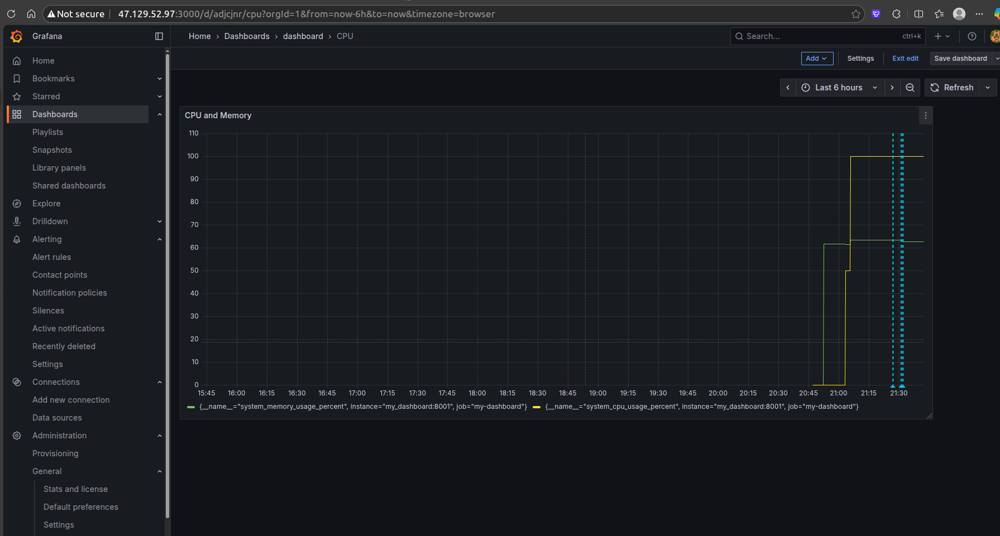
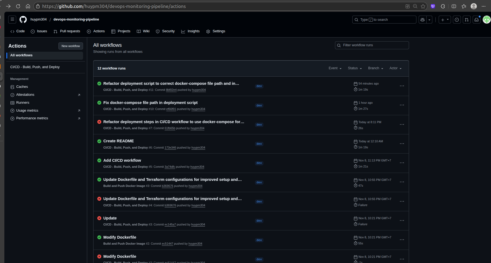
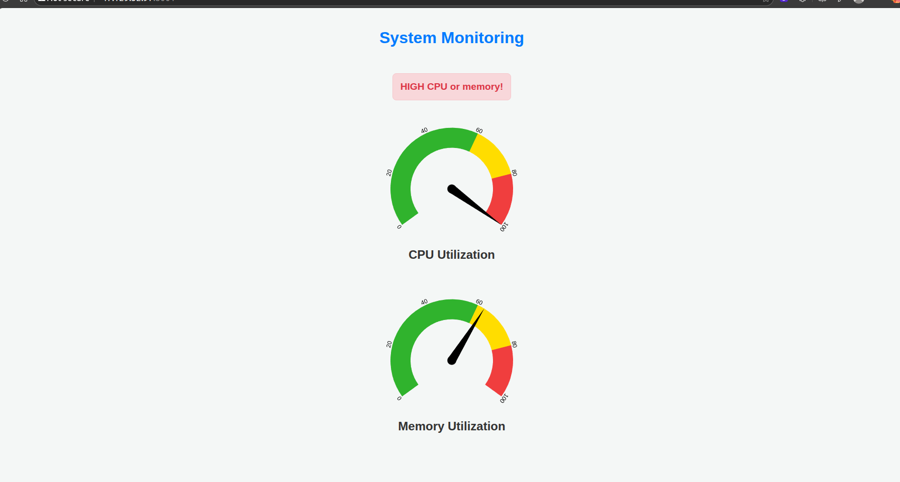

# End-to-End DevOps Observability Pipeline
A Fully Automated CI/CD and Monitoring System on AWS using Terraform, GitHub Actions, Docker, and Grafana_
## 1. Project Objective 

This repository documents a production-ready, fully automated CI/CD pipeline. The core objective is to showcase a **closed-loop, GitOps-driven Observability Stack** implementation on **AWS EC2**.

This project demonstrates expertise in: **IaC, CI/CD pipeline, Container Orchestration, and Real-time Monitoring/Alerting.**

---

## 2. Core Technologies 

| Domain | Technology |
| :--- | :--- |
| **CI/CD & Automation** | **GitHub Actions** (CI/CD), **Docker Compose** |
| **Infrastructure as Code** | **Terraform** |
| **Observability Stack** | **Prometheus** (Scraping/Storage), **Grafana** (Visualization/Alerting) |
| **Cloud Provider** | **AWS** (EC2, ECR, VPC, IAM, Security Group) |
| **Application** | **Python** (Flask, psutil, prometheus-client) |

---

## 3. Architecture & GitOps Workflow

This entire system is managed via a single `git push` command, ensuring continuous delivery and self-monitoring.

1.  **Provisioning (IaC):**
    **Terraform** provisions the entire AWS infrastructure, including an EC2 host bootstrapped via `user_data` to install **Docker** and **Docker Compose**. All security groups and IAM roles are configured for isolated network access.

2.  **CI (Integration):**
    A **GitHub Actions** workflow triggers on push. It containerizes the Python application, versions the artifact, and pushes it to **Amazon ECR**.

3.  **CD (Deployment):**
    The **Deploy** job automatically SSH-es into the EC2 host and executes a Docker Compose sequence, ensuring **zero downtime for monitoring services**:
    * **Pulls** the latest application image.
    * **Restarts** only the application container (`my-dashboard`).
    * **Prometheus** immediately scrapes the new application's metrics (`/metrics`).

4.  **Observability Loop:**
    The deployed application runs alongside its dedicated monitoring stack, allowing for real-time visualization in Grafana and **automated alerting** if CPU or Memory thresholds are exceeded.

---

## 4. Screenshots

#### Deployed Observability Stack (Grafana)
*Live Grafana dashboard visualizing real-time CPU & Memory metrics (scraped from the Python app) and ready for alert rule configuration.*

---

#### Automated CI/CD Pipeline (GitHub Actions)
*A successful end-to-end workflow run, showcasing the automated CI (Build) and CD (Deploy) jobs.*

---

#### Dashboard running live on AWS EC2

